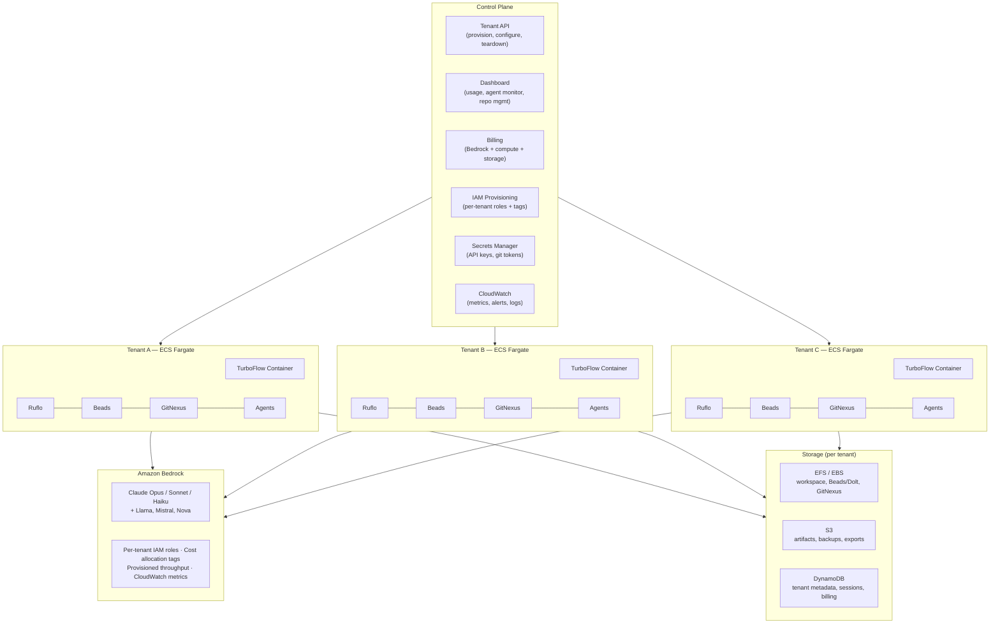
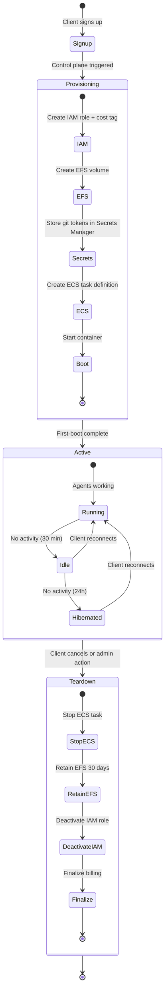
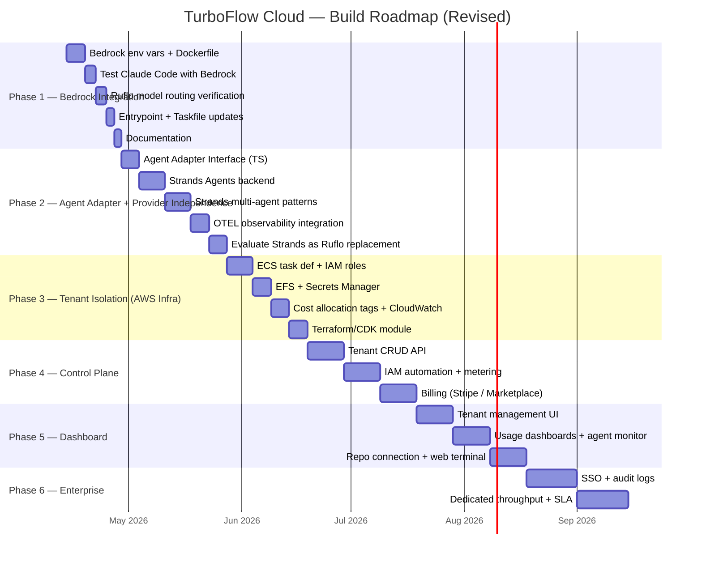
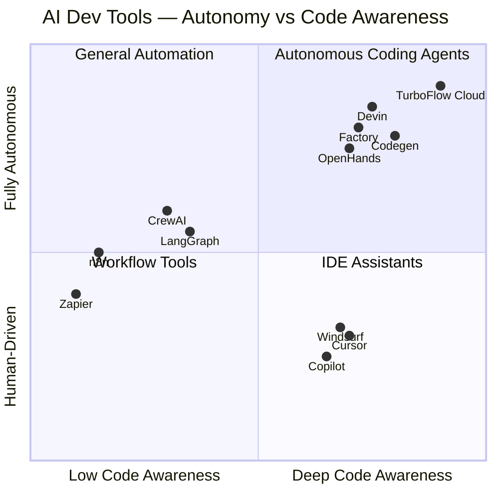
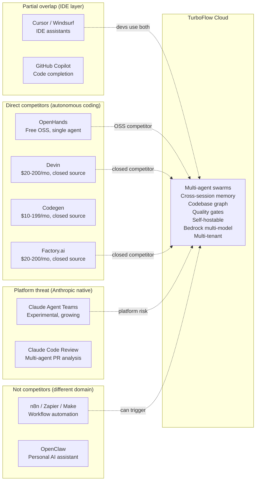
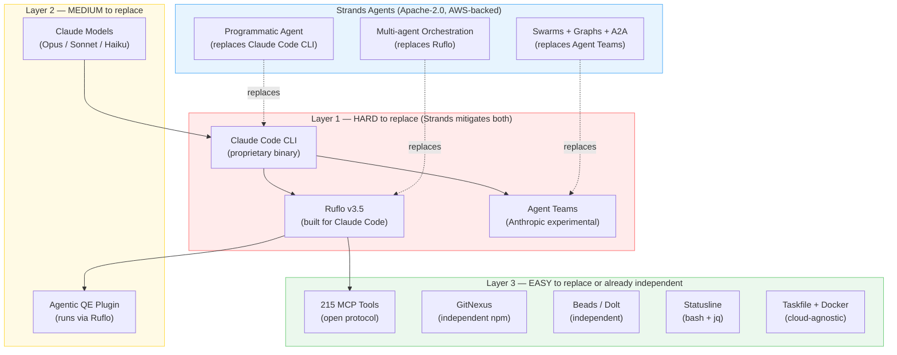
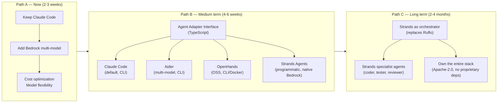

# TurboFlow Cloud — Multi-Tenant Agentic Development Platform

## Product Vision

A managed platform where each client gets their own TurboFlow tenant — a containerized agentic development environment with Claude Code, Ruflo orchestration, cross-session memory, and codebase intelligence — running on AWS with Bedrock as the model layer.

Clients connect their repos, their agents build software, and we handle infra, billing, and scaling.

---

## What We Have Today

The `feature/dockerize-turboflow` branch already provides:

- **Dockerfile** — pre-baked Ubuntu 24.04 image with all 10 setup steps
- **docker-compose.yml** — local development with volume persistence
- **docker-entrypoint.sh** — first-boot initialization (Dolt identity, Beads init, MCP registration, aliases)
- **bootstrap.sh** — universal entry point that installs Task runner and delegates to Taskfile.yml
- **Taskfile.yml** — idempotent, platform-aware setup (replaces 8 bash scripts, ~2,400 lines → ~300 lines YAML)
- **devbox.json** — optional Nix-based reproducible env
- **Templates** — CLAUDE.md, statusline, aliases as standalone files
- **MIT license** — commercially viable

Per-tenant unit of deployment: one Docker container with all tools pre-installed.

---

## Architecture



---

## Tenant Lifecycle



### Provisioning details

1. Client signs up via dashboard or API
2. Control plane creates:
   - IAM role with Bedrock access + cost allocation tag `tenant=<id>`
   - EFS volume for persistent workspace storage
   - Secrets Manager entries for git tokens, custom env vars
   - ECS task definition from the TurboFlow Docker image
3. Container starts with:
   ```bash
   CLAUDE_CODE_USE_BEDROCK=1
   AWS_REGION=us-east-1
   AWS_BEDROCK_MODEL_ID=anthropic.claude-sonnet-4-20250514
   # IAM role assumed via ECS task role — no access keys needed
   ```
4. First-boot entrypoint runs: Dolt identity, Beads init, MCP registration
5. Client connects their GitHub/GitLab repos
6. GitNexus indexes the repos → knowledge graph ready

### Runtime

- Client interacts via Claude Code CLI (SSH/web terminal) or future web UI
- Agents run through Ruflo → model calls go to Bedrock
- Beads persists decisions to Dolt on EFS
- GitNexus serves codebase intelligence via MCP
- CloudWatch captures per-tenant metrics (tokens, cost, agent activity)

### Teardown

- Control plane stops ECS task
- EFS volume retained for 30 days (configurable) then deleted
- IAM role deactivated
- Billing finalized

---

## Bedrock Integration

### Why Bedrock over direct Anthropic API

| Concern | Direct Anthropic API | Amazon Bedrock |
|---|---|---|
| Auth per tenant | Each needs ANTHROPIC_API_KEY | One AWS account, IAM roles per tenant |
| Billing | Can't see per-tenant costs easily | AWS cost allocation tags — native |
| Rate limits | Shared Anthropic limits | Provisioned throughput — partitioned |
| Data residency | Data goes to Anthropic | Stays in your AWS region |
| Model choice | Claude only | Claude + Llama + Mistral + Nova + Cohere |
| Compliance | Depends on Anthropic | AWS SOC2, HIPAA, FedRAMP, ISO 27001 |

### Environment variables per tenant container

```bash
CLAUDE_CODE_USE_BEDROCK=1
AWS_REGION=us-east-1

# Model routing (Ruflo handles tier selection)
BEDROCK_MODEL_OPUS=anthropic.claude-opus-4-20250514
BEDROCK_MODEL_SONNET=anthropic.claude-sonnet-4-20250514
BEDROCK_MODEL_HAIKU=anthropic.claude-haiku-4-20250514

# No access keys — ECS task role assumed automatically
# Cost allocation tag applied via IAM role policy
```

### Provisioned throughput strategy

- **Shared pool** for Starter/Pro tiers — on-demand Bedrock pricing, soft limits
- **Dedicated throughput** for Enterprise tier — reserved model units, guaranteed capacity
- **Burst handling** — CloudWatch alarm triggers scale-up of provisioned throughput

---

## Multi-Cloud Option

While Bedrock anchors the primary deployment on AWS, tenants could run on other clouds:

| Cloud | Compute | Model Layer | Notes |
|---|---|---|---|
| AWS | ECS Fargate / EKS | Bedrock | Primary, fully integrated |
| GCP | Cloud Run / GKE | Vertex AI (Claude via partner) | Requires Vertex AI Claude access |
| Azure | ACI / AKS | Azure AI (Claude via partner) | Requires Azure Claude access |
| On-prem | Docker / K8s | Direct Anthropic API or self-hosted | For air-gapped enterprise clients |

The Dockerfile and Taskfile are cloud-agnostic. Only the model routing env vars change per cloud.

---

## Revenue Model

### Pricing tiers

| Tier | Price | Includes | Target |
|---|---|---|---|
| Starter | $99/dev/month | 1M tokens, 1 agent, 5GB storage, shared compute | Solo devs, evaluation |
| Pro | $299/dev/month | 10M tokens, unlimited agents, 50GB storage, dedicated compute | Small teams |
| Enterprise | Custom | Unlimited tokens, dedicated throughput, SSO, audit logs, SLA | Companies |

### Cost structure (per tenant, estimated)

| Component | Monthly cost | Notes |
|---|---|---|
| ECS Fargate (2 vCPU, 8GB) | ~$60 | Running 8h/day, 22 days/month |
| EFS storage (10GB) | ~$3 | Beads, GitNexus, workspace |
| Bedrock tokens (1M) | ~$15-30 | Depends on model mix (Haiku vs Sonnet vs Opus) |
| Control plane share | ~$5 | Amortized across tenants |
| **Total cost per tenant** | **~$85-100** | |
| **Starter price** | **$99** | ~0-15% margin |
| **Pro price** | **$299** | ~60-70% margin at 10M tokens |

Margins improve with scale (shared control plane costs, reserved Bedrock capacity, Fargate Spot).

---

## Cost Analysis — Model Routing Impact

TurboFlow's v1.x docs claimed 85-99% cost savings via multi-model routing. Here's how that maps to current Bedrock pricing:

### Per-token costs (Bedrock, April 2026)

| Model | Input | Output | Cache read | Cache write |
|---|---|---|---|---|
| Claude Opus 4.6 | $5/M | $25/M | $0.50/M | $6.25/M |
| Claude Sonnet 4.6 | $3/M | $15/M | $0.30/M | $3.75/M |
| Claude Haiku 4.5 | $0.80/M | $4/M | $0.08/M | $1/M |
| Amazon Nova Pro | $0.80/M | $3.20/M | — | — |
| Amazon Nova Lite | $0.06/M | $0.24/M | — | — |
| Llama 3.x 70B | $0.72/M | $0.72/M | — | — |
| Llama 3.x 8B | $0.22/M | $0.22/M | — | — |

### Real-world cost per task (estimated, with caching)

| Routing strategy | Models used | Cost per task | Monthly (100 tasks/day) |
|---|---|---|---|
| No routing (Sonnet only) | Sonnet 4.6 | ~$0.03-0.08 | $90-240 |
| Ruflo 3-tier (current) | Opus + Sonnet + Haiku | ~$0.02-0.05 | $60-150 |
| Bedrock mixed (proposed) | Sonnet + Haiku + Nova Lite | ~$0.005-0.02 | $15-60 |
| Bedrock aggressive | Haiku + Nova Lite + Llama | ~$0.001-0.005 | $3-15 |

### Comparison with subscription plans

| Approach | Monthly cost (medium dev) | Per-tenant viable | Model flexibility |
|---|---|---|---|
| Claude Pro | $20 (fixed) | No | Claude only, rate limited |
| Claude Max 5x | $100 (fixed) | No | Claude only |
| Claude Max 20x | $200 (fixed) | No | Claude only |
| Bedrock (Ruflo 3-tier) | $60-150 (variable) | Yes | Claude models |
| Bedrock (mixed routing) | $15-60 (variable) | Yes | Claude + Nova + Llama |

### Product pricing implications

At Bedrock mixed routing ($15-60/tenant/month cost), the pricing tiers from the revenue model hold:

- Starter ($99/mo): cost ~$30-40 → margin ~60%
- Pro ($299/mo): cost ~$60-100 → margin ~65-80%
- Enterprise (custom): cost ~$100-200 → margin negotiable

The key lever is model routing. Ruflo's 3-tier routing already saves ~40% by using Haiku for simple tasks. Adding Nova Lite and Llama for boilerplate/formatting could push savings to 75-85%.

---

## What Needs to Be Built



### Phase 1: Bedrock integration (2-3 weeks)

- [ ] Add Bedrock env vars to Taskfile.yml and Dockerfile
- [ ] Test Claude Code with `CLAUDE_CODE_USE_BEDROCK=1`
- [ ] Verify Ruflo model routing works with Bedrock model IDs
- [ ] Update docker-entrypoint.sh to detect and configure Bedrock
- [ ] Add `task setup:bedrock` variant to Taskfile
- [ ] Document Bedrock setup in docs/

### Phase 2: Agent Adapter + Provider Independence (4-5 weeks) — PRIORITY

This phase reduces vendor risk and builds the foundation for all future work. The agent layer must be provider-independent before investing in infrastructure.

- [x] Agent Adapter Interface — TypeScript, Strategy + Factory + Registry patterns (`agent-adapter/ts/`)
- [x] Claude Code backend (CLI wrapper) — TypeScript + Python
- [x] Aider backend (CLI wrapper, multi-model) — TypeScript + Python
- [x] OpenHands backend (CLI/Docker wrapper) — TypeScript + Python
- [x] Shell integration (`shell-integration.sh`) + CLI (`tf-adapter`) — auto-detects Python or TypeScript
- [x] Taskfile, entrypoint, and aliases integration
- [x] **Python adapter** — parallel implementation with native Strands support (`agent-adapter/python/`)
- [x] **Strands Agents backend (Python)** — programmatic, native Bedrock, full SDK (Strands 1.35.0)
- [x] **TurboFlow Strands value layer** (`turboflow_adapter/strands/`):
  - [x] 7 pre-configured agent types with tuned prompts and default model tiers (coder, tester, reviewer, architect, researcher, coordinator, security)
  - [x] Automatic model tier selection based on task complexity (replaces Ruflo 3-tier routing)
  - [x] 8 TurboFlow-specific Strands tools (4 Beads + 4 file ops) — agents auto-check memory and track work
  - [x] 4 multi-agent team recipes using supervisor-agent pattern (feature, bug-fix, code-review, security-audit) — replaces `rf-swarm`
- [ ] Strands Agents backend (TypeScript) — programmatic, native Bedrock, TypeScript SDK
- [x] Strands + GitNexus integration — codebase intelligence as CLI tools + MCP client for Strands agents
- [x] OTEL observability — Strands telemetry setup (console/OTLP), execution tracker, cost estimation per task
- [x] Evaluate Strands as full Ruflo replacement — documented in `planning/ruflo-strands-evaluation.md`
- [ ] Document migration guide (Ruflo → Strands transition path)

#### Dual-language adapter architecture

The Agent Adapter is implemented in both TypeScript and Python as parallel first-class citizens. Both share the same design patterns (Strategy, Factory, Registry), the same CLI contract (`tf-adapter exec`, `tf-adapter status`, etc.), and the same shell integration. The shell auto-detects which runtime is available.

```
agent-adapter/
├── ts/                    # TypeScript adapter (Node.js 20+)
│   ├── src/backends/      # claude, aider, openhands
│   ├── src/adapter.ts     # Main adapter class
│   └── src/cli.ts         # CLI entry point
├── python/                # Python adapter (Python 3.10+, uv)
│   ├── turboflow_adapter/
│   │   ├── backends/      # claude, aider, openhands, strands
│   │   ├── strands/       # TurboFlow value layer
│   │   │   ├── agents.py  # 7 pre-configured agent types
│   │   │   ├── models.py  # Model factory + auto tier selection
│   │   │   ├── tools.py   # 8 TurboFlow tools (Beads + file ops)
│   │   │   └── team.py    # 4 multi-agent team recipes
│   │   ├── adapter.py     # Main adapter class
│   │   └── cli.py         # CLI entry point (Click)
│   └── pyproject.toml
├── shell-integration.sh   # Auto-detects Python or TypeScript runtime
└── USE_CASES.md           # Hands-on examples
```

Why both languages:
- Strands Python SDK is more mature (30+ built-in tools, more model providers, bidirectional streaming, agent steering)
- Python is the lingua franca of the AI/ML ecosystem
- TurboFlow already installs Python 3 on every platform
- Tenants who code in Python get a native experience; TypeScript tenants keep theirs

### Phase 3: Tenant isolation — AWS infrastructure (3-4 weeks)

- [ ] ECS task definition with per-tenant IAM role
- [ ] EFS volume provisioning per tenant
- [ ] Secrets Manager integration for git tokens
- [ ] Cost allocation tags on all resources
- [ ] CloudWatch log groups per tenant
- [ ] Terraform/CDK module for tenant provisioning

### Phase 4: Control plane API (4-6 weeks)

- [ ] Tenant CRUD API (create, configure, suspend, delete)
- [ ] IAM role provisioning automation
- [ ] Usage metering (Bedrock tokens, compute hours, storage)
- [ ] Billing integration (Stripe or AWS Marketplace)
- [ ] Health checks and auto-restart
- [ ] API authentication (API keys or OAuth)

### Phase 5: Dashboard (4-6 weeks)

- [ ] Tenant management UI
- [ ] Usage and cost dashboards
- [ ] Agent activity monitor (real-time)
- [ ] Repo connection flow (GitHub OAuth)
- [ ] Team management (invite, roles)
- [ ] Web terminal (SSH to tenant container)

### Phase 6: Enterprise features (ongoing)

- [ ] SSO (SAML/OIDC)
- [ ] Audit logs
- [ ] Custom model routing policies
- [ ] Dedicated Bedrock throughput
- [ ] SLA monitoring
- [ ] On-prem deployment option

---

## Risks and Mitigations

### 1. Ruflo is third-party

**Risk:** Ruflo (by ruvnet) could change direction, go paid, or break compatibility.

**Mitigation:** 
- Fork Ruflo at a known-good version as a fallback
- Abstract orchestration behind an interface so Ruflo can be swapped
- **Strands Agents SDK** (Apache-2.0, AWS-backed) provides equivalent multi-agent orchestration patterns (swarms, hierarchies, supervisor-agent) and is a viable replacement — see Phase 2 and Path C in Provider Independence Strategy
- Long-term: migrate to Strands as orchestrator (eliminates third-party risk entirely)

### 2. Claude Code licensing

**Risk:** Claude Code is Anthropic's proprietary binary. Reselling managed access may have licensing implications.

**Mitigation:**
- Review Anthropic's Claude Code terms of service
- Contact Anthropic's partnerships team for commercial licensing
- **Agent Adapter Interface** allows switching to non-proprietary backends (Aider, OpenHands, Strands) without changing the rest of the stack
- **Strands Agents** can call Bedrock directly via SDK — no Claude Code binary needed for programmatic/automated use cases

### 3. Bedrock pricing changes

**Risk:** AWS could change Bedrock pricing, affecting margins.

**Mitigation:**
- Usage-based pricing passes cost changes to clients
- Reserved throughput locks in pricing for Enterprise tier
- Multi-model routing (use cheaper models for simple tasks) optimizes cost

### 4. Container cold start

**Risk:** Spinning up a full TurboFlow container takes time (npm installs, Ruflo init).

**Mitigation:**
- Pre-baked Docker image (already done) — cold start is ~30s, not ~10min
- Keep containers warm for active tenants (ECS service with min capacity 1)
- Hibernate idle containers to EFS, resume on demand

---

## Competitive Landscape

### Market categories

The AI development tooling market splits into 5 distinct categories. TurboFlow Cloud sits in Category 3/4 overlap — a multi-agent coding platform with orchestration.



### Category 1: Workflow automation (n8n, Zapier, Make)

Connect SaaS apps together. "When a form is submitted → create Jira ticket → send Slack message → update spreadsheet."

- Visual drag-and-drop builders, 1,000+ integrations
- n8n added AI nodes (LangChain) but it's workflow automation with AI steps, not AI that develops software
- Not code-aware — they don't read repos, write code, or run tests

Overlap with TurboFlow: near zero. n8n could trigger a TurboFlow tenant ("new Jira ticket → kick off agent swarm"), but they don't compete.

### Category 2: IDE assistants (Cursor, Windsurf, GitHub Copilot, Amazon Q)

Live inside your editor. Autocomplete, inline chat, explain code.

- Tightly coupled to an editor (VS Code, JetBrains)
- Single-model, single-agent, one conversation at a time
- No persistent memory, no multi-agent orchestration, no codebase graph

Overlap with TurboFlow: partial. These are the "hands" — TurboFlow is the "brain + team." A developer could use Cursor for quick edits and TurboFlow for complex multi-file features.

### Category 3: Autonomous coding agents (Devin, Factory.ai, Codegen, OpenHands)

Take a task description → autonomously plan, code, test, submit PR. Closest competitors.

| | Devin | Factory.ai | Codegen | OpenHands | TurboFlow Cloud |
|---|---|---|---|---|---|
| Pricing | $20-200/mo | $20-200/mo | $10-199/mo | Free (OSS) + cloud | TBD |
| Open source | No | No | No | Yes (MIT) | Yes (MIT) |
| Self-hostable | No | No | No | Yes (Docker) | Yes (Docker/K8s/Bedrock) |
| Multi-agent | Single agent | Single agent | Single agent | Single agent | Multi-agent swarms (Ruflo) |
| Cross-session memory | No | No | No | No | Yes (Beads/Dolt) |
| Codebase graph | Limited | Limited | Yes (core feature) | No | Yes (GitNexus) |
| Model choice | Proprietary | Proprietary | Proprietary | Multi-model | Multi-model (Bedrock) |
| Agent isolation | Sandbox per task | Sandbox per task | Sandbox per task | Docker sandbox | Git worktrees per agent |
| Quality gates | Basic tests | Basic tests | Basic tests | Basic tests | Agentic QE (58 agents) |
| Bedrock/enterprise | No | No | No | Possible | Native |

### Category 4: Agent orchestration frameworks (CrewAI, LangGraph, AutoGen, Strands Agents)

Libraries/SDKs for building multi-agent systems. Building blocks, not finished products.

- CrewAI: role-based agent teams in Python (5.2M monthly downloads)
- LangGraph: stateful graph workflows (most precise control)
- AutoGen: multi-agent conversations (Microsoft)
- **Strands Agents**: model-driven agent SDK from AWS (Apache-2.0, TypeScript + Python, native Bedrock, OTEL, MCP, A2A). Used in production by Kiro, Amazon Q, and AWS Glue.

Overlap with TurboFlow: architectural. Ruflo is conceptually similar — it coordinates multiple agents. But TurboFlow is a complete environment, not a framework you build on. **Strands is the strongest candidate to replace Ruflo** because it provides equivalent multi-agent patterns, native Bedrock support, and is AWS-backed with a TypeScript SDK that integrates directly into TurboFlow's codebase.

### Category 5: Claude's own features (Agent Teams, Claude Code Review)

This is the most important competitive dynamic. Anthropic is building some of what TurboFlow provides directly into Claude Code:

- Agent Teams (Feb 2026): multiple Claude instances in parallel, peer-to-peer communication, shared task lists
- Claude Code Review (Mar 2026): multi-agent PR analysis for bugs and security

| Feature | Claude Code native | TurboFlow adds |
|---|---|---|
| Multi-agent | Agent Teams (experimental) | Ruflo swarm topologies (hierarchical, mesh, ring, star), 60+ agent types |
| Memory | None across sessions | Beads (cross-session, git-backed, branchable) |
| Codebase intelligence | Basic file reading | GitNexus knowledge graph + blast-radius detection |
| Quality gates | None | Agentic QE (58 agents, TDD, security, chaos) |
| Agent isolation | Shared workspace | Git worktrees + PG Vector schema namespacing |
| Model routing | Single model | 3-tier routing (Opus/Sonnet/Haiku) via Ruflo |
| Observability | Basic | Statusline Pro (15 components, cost tracking) |
| Self-hosting | No | Yes (Docker/K8s/Bedrock) |
| Multi-tenant | No | Yes (per-tenant IAM, billing, isolation) |

### Positioning map



### Defensible moats

1. **Self-hosting + Bedrock** — enterprises that can't use Anthropic's cloud or need data residency
2. **Multi-tenant platform** — managed service with per-tenant billing, isolation, monitoring (no competitor offers this)
3. **Cross-session memory (Beads)** — genuinely unique; no competitor has git-backed, branchable project memory
4. **Quality gates (Agentic QE)** — 58-agent pipeline deeper than anything competitors offer
5. **Open source core** — community contributions, transparency, no vendor lock-in
6. **Bedrock multi-model** — not locked to one provider; can route to cheaper models for simple tasks

### Primary risk

Anthropic themselves. If Claude Code's Agent Teams matures, if they add persistent memory, if they add codebase graphs — TurboFlow's value proposition narrows. The defense is the multi-tenant platform layer and Bedrock self-hosting, which Anthropic is unlikely to build (they want you on their API, not AWS's).

---

## Provider Independence Strategy

### Claude dependency map

TurboFlow has 3 layers of Claude dependency, from hardest to easiest to replace:



### Replacement options per component

| Current component | Claude dependency | Replacement candidates | Effort | Risk |
|---|---|---|---|---|
| Claude Code CLI | Hard (proprietary binary) | **Strands Agents (Apache 2, programmatic)**, Aider (Apache 2), OpenHands (MIT), Goose (Apache 2) | Medium | Agent Adapter abstracts the switch |
| Ruflo orchestration | Hard (built for Claude Code) | **Strands Agents (swarms, hierarchies, supervisor-agent)**, CrewAI, LangGraph | Medium | Strands covers same patterns; must rebuild used agent types |
| Claude models | Medium (API) | Bedrock multi-model, LiteLLM proxy, OpenRouter | Low-Medium | Already possible via Bedrock |
| MCP tools (215) | Low (open protocol) | **Strands (native MCP support)**, any MCP-compatible agent | Low | MCP is an open standard |
| GitNexus | None | Keep as-is | Zero | No Claude dependency |
| Beads / Dolt | None | Keep as-is | Zero | No Claude dependency |
| Agentic QE plugin | Medium (runs via Ruflo) | Adapt to Strands orchestrator | Medium | Depends on orchestrator replacement |
| Agent Teams | Hard (Anthropic experimental) | **Strands multi-agent (swarms, graphs, A2A)**, CrewAI teams | Medium | Strands provides equivalent patterns |
| Statusline | None (bash + jq) | Keep as-is (augment with Strands OTEL) | Zero | No Claude dependency |
| Taskfile + Docker | None | Keep as-is | Zero | No Claude dependency |

### Agent CLI alternatives

| Alternative | Provider | Open source | Agentic | Multi-agent | MCP support | Multi-model |
|---|---|---|---|---|---|---|
| Claude Code | Anthropic | No | Yes | Yes (Agent Teams) | Yes | Claude only (+ Bedrock) |
| Aider | Independent | Yes (Apache 2) | Yes | No | No | Yes (any OpenAI-compatible) |
| OpenHands | All Hands AI | Yes (MIT) | Yes | No | Yes | Yes |
| Cline | Community | Yes (Apache 2) | Yes (VS Code) | No | Yes | Yes |
| Codex CLI | OpenAI | Yes (Apache 2) | Yes | No | No | OpenAI models |
| Goose | Block (Square) | Yes (Apache 2) | Yes | No | Yes | Yes |
| Amazon Q CLI | AWS | No (free tier) | Yes | No | No | AWS models |
| **Strands Agents** | **AWS** | **Yes (Apache 2)** | **Yes** | **Yes (swarms, graphs, hierarchies)** | **Yes** | **Yes (Bedrock, OpenAI, Anthropic, Google, Ollama)** |

### Strands Agents SDK — Strategic Analysis

[Strands Agents](https://strandsagents.com/) is an open-source (Apache-2.0) agent SDK from AWS. It uses a model-driven approach: you provide a prompt, tools, and a model provider, and the LLM handles reasoning, planning, and tool execution autonomously. It's used in production by AWS teams including Kiro, Amazon Q, and AWS Glue.

#### Why Strands is uniquely relevant to TurboFlow

Strands is not just another CLI alternative — it operates at a different level. While Claude Code, Aider, and OpenHands are agent CLIs (you shell out to them), Strands is a **programmatic agent SDK** with a TypeScript package (`@strands-agents/sdk`). This means it can be imported directly into TurboFlow's TypeScript codebase, invoked from APIs, and composed into multi-agent systems — without depending on any external binary.

#### Strands vs Ruflo — capability overlap

| Capability | Ruflo | Strands Agents |
|---|---|---|
| Multi-agent orchestration | Swarm topologies (hierarchical, mesh, ring, star) | Swarms, graphs, hierarchies, supervisor-agent, agent-as-tool |
| MCP tools | 215 tools via Claude Code | Native MCP support (open protocol) |
| Agent-as-tool pattern | Custom implementation | First-class (`@tool` decorator, agents as tools) |
| Model routing | 3-tier (Opus/Sonnet/Haiku) | Multi-model via providers (Bedrock, OpenAI, Anthropic, Google, Ollama) |
| Observability | Statusline Pro (bash + jq) | OpenTelemetry (distributed traces, metrics, structured logs) |
| Bedrock integration | Via env vars | First-class `BedrockModel` provider |
| Session management | None (relies on Beads) | Built-in (file, S3, repository managers) |
| Lifecycle hooks | None | Built-in hook system |
| License | Third-party npm (risk #1 in plan) | Apache-2.0, AWS-backed |
| TypeScript SDK | No (CLI only) | Yes (native, `@strands-agents/sdk`) |
| Deployment | Container only | Lambda, Fargate, ECS, EKS, Bedrock AgentCore |
| A2A (Agent-to-Agent) | No | Yes (open protocol) |

#### Strands directly mitigates top risks

1. **Risk #1 (Ruflo is third-party):** Strands is AWS-backed, Apache-2.0, used in production by AWS services. It provides the same multi-agent orchestration patterns Ruflo does, without the third-party dependency risk.
2. **Risk #2 (Claude Code licensing):** Strands agents don't require the Claude Code binary. They call Bedrock (or any model provider) directly via the SDK. This eliminates the proprietary binary dependency entirely for programmatic/automated use cases.
3. **Risk #4 (Container cold start):** Strands agents can deploy to Lambda (serverless, instant start) or Bedrock AgentCore, not just containers.

#### What Strands does NOT replace

- **Claude Code CLI for interactive use:** Developers who want a terminal-based coding assistant still use `claude`. Strands is programmatic, not a REPL.
- **Beads / Dolt:** Strands has session management but not git-backed, branchable project memory. Beads remains unique.
- **GitNexus:** Strands has no codebase knowledge graph. GitNexus remains unique.
- **Statusline Pro:** Strands has OTEL observability but not the terminal-based statusline. Both can coexist.

#### Two roles for Strands in TurboFlow

**Role 1 — As a backend in the Agent Adapter (implemented, verified)**

Strands is the fourth backend alongside Claude Code, Aider, and OpenHands. Unlike the CLI-based backends, Strands is invoked programmatically from Python — no shell-out needed. Verified end-to-end with Bedrock (Strands 1.35.0, Haiku + Sonnet models).

On top of the raw Strands SDK, TurboFlow adds a value layer (`turboflow_adapter/strands/`) that provides:

- **Pre-configured agent types** — `create_agent("coder")` gives you a Sonnet-powered coding agent with Beads memory, file tools, and a tuned system prompt. 7 types available.
- **Automatic model routing** — `select_tier(task)` picks opus/sonnet/haiku based on task complexity. Replaces Ruflo's 3-tier routing.
- **Multi-agent team recipes** — `create_team("feature")` creates a supervisor + 4 specialists (architect, coder, tester, reviewer) using Strands' agents-as-tools pattern. Replaces `rf-swarm`.
- **Beads integration** — 4 Beads tools (ready, create, close, remember) built into every agent. Agents auto-check project state and record decisions.
- **File tools** — read, write, list, run_command included by default.

```python
from turboflow_adapter.strands import create_agent, create_team, select_tier

# Single agent with auto-configured everything
coder = create_agent("coder")
result = coder("implement the login feature")

# Multi-agent team — one line
team = create_team("feature")
result = team("Add rate limiting to the API")

# Auto model routing
tier = select_tier("Fix typo in README")  # → haiku (cheapest)
tier = select_tier("Design event-driven architecture for...")  # → opus (most capable)
```

**Role 2 — Replace Ruflo as the orchestrator (medium-term, aligns with Path C)**

Strands' supervisor-agent pattern maps directly to how Ruflo orchestrates agent swarms. A coordinator agent delegates to specialist agents (coder, tester, reviewer) exposed as tools. This would eliminate both the Ruflo and Claude Code dependencies while gaining OTEL observability, A2A protocol support, and native Bedrock AgentCore deployment.

```
Current:  Ruflo → Claude Code CLI → Bedrock
Future:   Strands Orchestrator Agent → Strands Specialist Agents → Bedrock
          (all TypeScript, all programmatic, all Apache-2.0)
```

### Migration paths



#### Path A: Keep Claude Code, add model flexibility (lowest effort)

Keep the architecture as-is but route model calls through Bedrock or LiteLLM. Claude Code stays as the agent, but the underlying LLM can be Claude, GPT-4, Gemini, or Llama depending on the task.

- Effort: 2-3 weeks
- Gain: cost optimization, reduced model lock-in
- Limitation: still depends on Claude Code binary

#### Path B: Abstract the agent layer + add Strands (medium effort)

Create an adapter interface between Ruflo and the agent backends. Support Claude Code as the primary backend for interactive CLI use, and add Strands Agents as the programmatic backend for automated/API-driven use. Aider and OpenHands available as additional CLI options.

```
Ruflo orchestrator (existing, unchanged)
    ↓
Agent Adapter Interface (TypeScript, Strategy pattern)
    ↓
┌─────────────┬──────────────┬──────────────┬──────────────────┐
│ Claude Code │    Aider     │  OpenHands   │  Strands Agents  │
│ (default,   │ (multi-model │  (OSS,       │  (programmatic,  │
│  CLI)       │  CLI)        │  CLI/Docker) │  native Bedrock) │
└─────────────┴──────────────┴──────────────┴──────────────────┘
```

- Effort: 4-6 weeks
- Gain: clients choose their agent backend; Strands provides a fully open-source, programmatic path with no proprietary binary dependency
- Limitation: feature parity gap between backends (Agent Teams only on Claude Code, OTEL only on Strands)
- **Status: Agent Adapter implemented** (`agent-adapter/` — TypeScript, Strategy + Factory + Registry patterns). Strands backend to be added.

#### Path C: Strands as orchestrator — replace Ruflo (highest strategic value)

Replace both Claude Code and Ruflo with Strands Agents for orchestration. Use Strands' supervisor-agent pattern where a coordinator agent delegates to specialist agents (coder, tester, reviewer, security) exposed as tools. Each specialist is a Strands Agent with its own system prompt, tools, and model configuration.

```
Strands Orchestrator Agent (coordinator)
    ↓ agents-as-tools
┌──────────┬──────────┬──────────┬──────────────┐
│  Coder   │  Tester  │ Reviewer │  Security    │
│  Agent   │  Agent   │  Agent   │  Architect   │
└──────────┴──────────┴──────────┴──────────────┘
    ↓ all agents use
┌──────────────────────────────────────────────┐
│  Bedrock (Claude, Nova, Llama)               │
│  MCP Tools (GitNexus, custom)                │
│  Beads (cross-session memory)                │
│  OTEL (distributed tracing + metrics)        │
└──────────────────────────────────────────────┘
```

- Effort: 2-4 months
- Gain: full provider independence, own the entire stack (Apache-2.0), OTEL observability, A2A protocol, deployable to Lambda/Fargate/Bedrock AgentCore
- Limitation: lose Ruflo's 215 pre-built MCP tools and 60+ agent types (must rebuild the ones actually used)
- **Key advantage over original Path C:** Strands is a proven, AWS-backed framework — not building from scratch with LangGraph/CrewAI. Reduces effort from 3-6 months to 2-4 months.

### What's already portable (zero effort)

~40% of TurboFlow's value has no Claude dependency at all:

- Beads / Dolt (cross-session memory)
- GitNexus (codebase knowledge graph)
- Statusline Pro (observability)
- Taskfile + Docker + bootstrap (infrastructure)
- Templates (CLAUDE.md, aliases)
- tmux workspace

This is the 40% that no competitor has — and it works with any agent backend.

### Recommendation

Start with Path A (Bedrock) — already in progress. Move immediately to Path B (Agent Adapter + Strands backend) as the primary development focus. Path B is the highest-leverage work: it reduces vendor risk, adds a programmatic agent option, and lays the groundwork for Path C. Infrastructure (tenant isolation, control plane) comes after the agent layer is provider-independent.

Path C (Strands as orchestrator) should be evaluated after gaining hands-on experience with Strands through Path B. The portable components (Beads, GitNexus, infra) are the strategic assets — they're unique, provider-independent, and defensible regardless of which orchestration layer is used.

---

## Next Steps

1. ~~Validate Bedrock integration on the current branch (Path A)~~ — in progress
2. ~~Design the Agent Adapter Interface (Path B groundwork)~~ — **done** (`agent-adapter/ts/`)
3. ~~Implement Strands Agents backend~~ — **done** (Python, Strands 1.35.0, verified with Bedrock)
4. ~~Build Strands multi-agent patterns~~ — **done** (4 team recipes: feature, bug-fix, code-review, security-audit)
5. ~~Integrate Strands with Beads~~ — **done** (4 Beads tools built into every agent)
6. ~~Auto model routing~~ — **done** (`select_tier()` replaces Ruflo 3-tier routing)
7. ~~Integrate Strands with GitNexus~~ — **done** (CLI tools + MCP client for full 7-tool access)
8. ~~Add OTEL observability~~ — **done** (setup_telemetry for console/OTLP, track_execution context manager, cost estimation)
9. ~~Evaluate Strands as full Ruflo replacement~~ — **done** (`planning/ruflo-strands-evaluation.md`). Core workflow covered; gaps in AgentDB, deep QE, hooks intelligence, neural training.
10. Deploy 2-3 internal tenants on ECS to prove the model (Phase 3)
11. Build control plane (tenant CRUD + IAM provisioning)
12. Pilot with 1-2 external clients
13. Build dashboard and billing
14. Launch
