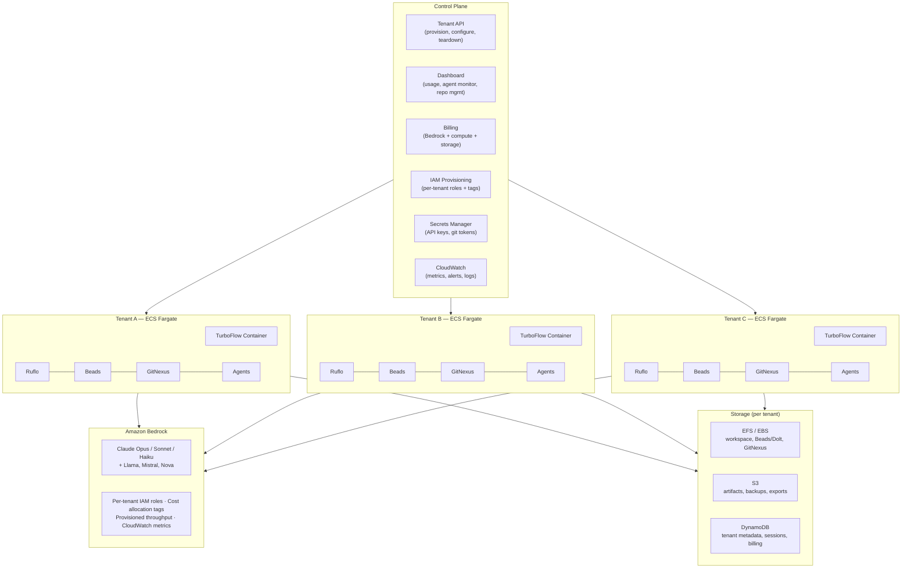
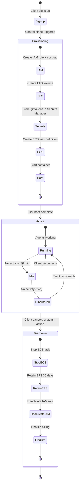
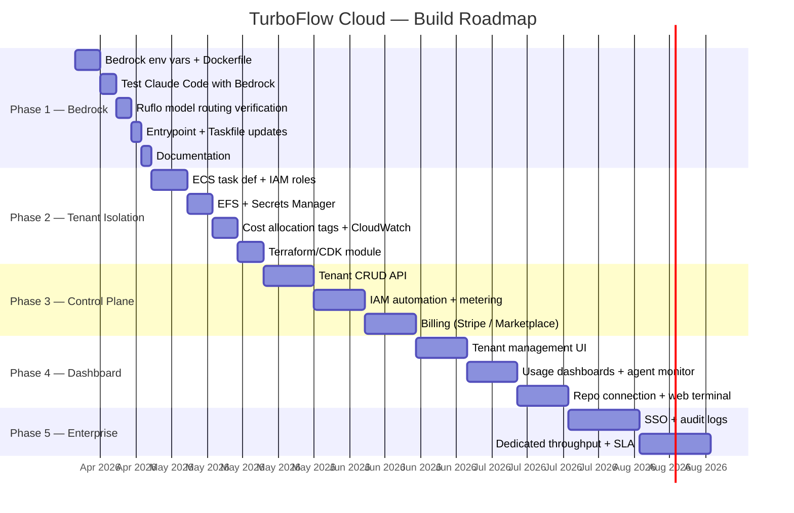
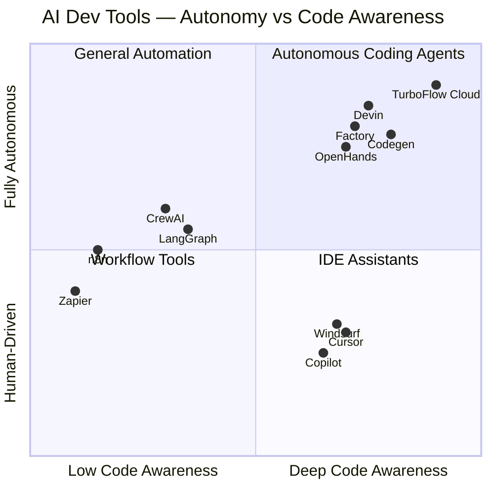
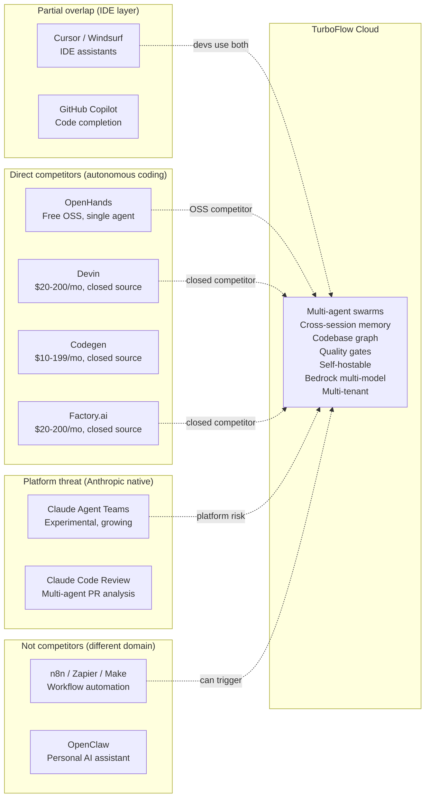
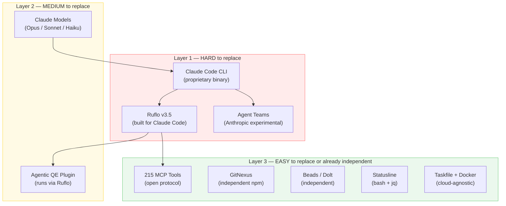
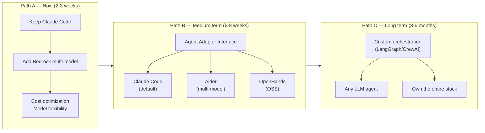

# TurboFlow Cloud — Multi-Tenant Agentic Development Platform

## Product Vision

A managed platform where each client gets their own TurboFlow tenant — a containerized agentic development environment with Claude Code, Ruflo orchestration, cross-session memory, and codebase intelligence — running on AWS with Bedrock as the model layer.

Clients connect their repos, their agents build software, and we handle infra, billing, and scaling.

---

## What We Have Today

The `feature/dockerize-turboflow` branch already provides:

- **Dockerfile** — pre-baked Ubuntu 24.04 image with all 10 setup steps
- **docker-compose.yml** — local development with volume persistence
- **docker-entrypoint.sh** — first-boot initialization (Dolt identity, Beads init, MCP registration, aliases)
- **bootstrap.sh** — universal entry point that installs Task runner and delegates to Taskfile.yml
- **Taskfile.yml** — idempotent, platform-aware setup (replaces 8 bash scripts, ~2,400 lines → ~300 lines YAML)
- **devbox.json** — optional Nix-based reproducible env
- **Templates** — CLAUDE.md, statusline, aliases as standalone files
- **MIT license** — commercially viable

Per-tenant unit of deployment: one Docker container with all tools pre-installed.

---

## Architecture



---

## Tenant Lifecycle



### Provisioning details

1. Client signs up via dashboard or API
2. Control plane creates:
   - IAM role with Bedrock access + cost allocation tag `tenant=<id>`
   - EFS volume for persistent workspace storage
   - Secrets Manager entries for git tokens, custom env vars
   - ECS task definition from the TurboFlow Docker image
3. Container starts with:
   ```bash
   CLAUDE_CODE_USE_BEDROCK=1
   AWS_REGION=us-east-1
   AWS_BEDROCK_MODEL_ID=anthropic.claude-sonnet-4-20250514
   # IAM role assumed via ECS task role — no access keys needed
   ```
4. First-boot entrypoint runs: Dolt identity, Beads init, MCP registration
5. Client connects their GitHub/GitLab repos
6. GitNexus indexes the repos → knowledge graph ready

### Runtime

- Client interacts via Claude Code CLI (SSH/web terminal) or future web UI
- Agents run through Ruflo → model calls go to Bedrock
- Beads persists decisions to Dolt on EFS
- GitNexus serves codebase intelligence via MCP
- CloudWatch captures per-tenant metrics (tokens, cost, agent activity)

### Teardown

- Control plane stops ECS task
- EFS volume retained for 30 days (configurable) then deleted
- IAM role deactivated
- Billing finalized

---

## Bedrock Integration

### Why Bedrock over direct Anthropic API

| Concern | Direct Anthropic API | Amazon Bedrock |
|---|---|---|
| Auth per tenant | Each needs ANTHROPIC_API_KEY | One AWS account, IAM roles per tenant |
| Billing | Can't see per-tenant costs easily | AWS cost allocation tags — native |
| Rate limits | Shared Anthropic limits | Provisioned throughput — partitioned |
| Data residency | Data goes to Anthropic | Stays in your AWS region |
| Model choice | Claude only | Claude + Llama + Mistral + Nova + Cohere |
| Compliance | Depends on Anthropic | AWS SOC2, HIPAA, FedRAMP, ISO 27001 |

### Environment variables per tenant container

```bash
CLAUDE_CODE_USE_BEDROCK=1
AWS_REGION=us-east-1

# Model routing (Ruflo handles tier selection)
BEDROCK_MODEL_OPUS=anthropic.claude-opus-4-20250514
BEDROCK_MODEL_SONNET=anthropic.claude-sonnet-4-20250514
BEDROCK_MODEL_HAIKU=anthropic.claude-haiku-4-20250514

# No access keys — ECS task role assumed automatically
# Cost allocation tag applied via IAM role policy
```

### Provisioned throughput strategy

- **Shared pool** for Starter/Pro tiers — on-demand Bedrock pricing, soft limits
- **Dedicated throughput** for Enterprise tier — reserved model units, guaranteed capacity
- **Burst handling** — CloudWatch alarm triggers scale-up of provisioned throughput

---

## Multi-Cloud Option

While Bedrock anchors the primary deployment on AWS, tenants could run on other clouds:

| Cloud | Compute | Model Layer | Notes |
|---|---|---|---|
| AWS | ECS Fargate / EKS | Bedrock | Primary, fully integrated |
| GCP | Cloud Run / GKE | Vertex AI (Claude via partner) | Requires Vertex AI Claude access |
| Azure | ACI / AKS | Azure AI (Claude via partner) | Requires Azure Claude access |
| On-prem | Docker / K8s | Direct Anthropic API or self-hosted | For air-gapped enterprise clients |

The Dockerfile and Taskfile are cloud-agnostic. Only the model routing env vars change per cloud.

---

## Revenue Model

### Pricing tiers

| Tier | Price | Includes | Target |
|---|---|---|---|
| Starter | $99/dev/month | 1M tokens, 1 agent, 5GB storage, shared compute | Solo devs, evaluation |
| Pro | $299/dev/month | 10M tokens, unlimited agents, 50GB storage, dedicated compute | Small teams |
| Enterprise | Custom | Unlimited tokens, dedicated throughput, SSO, audit logs, SLA | Companies |

### Cost structure (per tenant, estimated)

| Component | Monthly cost | Notes |
|---|---|---|
| ECS Fargate (2 vCPU, 8GB) | ~$60 | Running 8h/day, 22 days/month |
| EFS storage (10GB) | ~$3 | Beads, GitNexus, workspace |
| Bedrock tokens (1M) | ~$15-30 | Depends on model mix (Haiku vs Sonnet vs Opus) |
| Control plane share | ~$5 | Amortized across tenants |
| **Total cost per tenant** | **~$85-100** | |
| **Starter price** | **$99** | ~0-15% margin |
| **Pro price** | **$299** | ~60-70% margin at 10M tokens |

Margins improve with scale (shared control plane costs, reserved Bedrock capacity, Fargate Spot).

---

## Cost Analysis — Model Routing Impact

TurboFlow's v1.x docs claimed 85-99% cost savings via multi-model routing. Here's how that maps to current Bedrock pricing:

### Per-token costs (Bedrock, April 2026)

| Model | Input | Output | Cache read | Cache write |
|---|---|---|---|---|
| Claude Opus 4.6 | $5/M | $25/M | $0.50/M | $6.25/M |
| Claude Sonnet 4.6 | $3/M | $15/M | $0.30/M | $3.75/M |
| Claude Haiku 4.5 | $0.80/M | $4/M | $0.08/M | $1/M |
| Amazon Nova Pro | $0.80/M | $3.20/M | — | — |
| Amazon Nova Lite | $0.06/M | $0.24/M | — | — |
| Llama 3.x 70B | $0.72/M | $0.72/M | — | — |
| Llama 3.x 8B | $0.22/M | $0.22/M | — | — |

### Real-world cost per task (estimated, with caching)

| Routing strategy | Models used | Cost per task | Monthly (100 tasks/day) |
|---|---|---|---|
| No routing (Sonnet only) | Sonnet 4.6 | ~$0.03-0.08 | $90-240 |
| Ruflo 3-tier (current) | Opus + Sonnet + Haiku | ~$0.02-0.05 | $60-150 |
| Bedrock mixed (proposed) | Sonnet + Haiku + Nova Lite | ~$0.005-0.02 | $15-60 |
| Bedrock aggressive | Haiku + Nova Lite + Llama | ~$0.001-0.005 | $3-15 |

### Comparison with subscription plans

| Approach | Monthly cost (medium dev) | Per-tenant viable | Model flexibility |
|---|---|---|---|
| Claude Pro | $20 (fixed) | No | Claude only, rate limited |
| Claude Max 5x | $100 (fixed) | No | Claude only |
| Claude Max 20x | $200 (fixed) | No | Claude only |
| Bedrock (Ruflo 3-tier) | $60-150 (variable) | Yes | Claude models |
| Bedrock (mixed routing) | $15-60 (variable) | Yes | Claude + Nova + Llama |

### Product pricing implications

At Bedrock mixed routing ($15-60/tenant/month cost), the pricing tiers from the revenue model hold:

- Starter ($99/mo): cost ~$30-40 → margin ~60%
- Pro ($299/mo): cost ~$60-100 → margin ~65-80%
- Enterprise (custom): cost ~$100-200 → margin negotiable

The key lever is model routing. Ruflo's 3-tier routing already saves ~40% by using Haiku for simple tasks. Adding Nova Lite and Llama for boilerplate/formatting could push savings to 75-85%.

---

## What Needs to Be Built



### Phase 1: Bedrock integration (2-3 weeks)

- [ ] Add Bedrock env vars to Taskfile.yml and Dockerfile
- [ ] Test Claude Code with `CLAUDE_CODE_USE_BEDROCK=1`
- [ ] Verify Ruflo model routing works with Bedrock model IDs
- [ ] Update docker-entrypoint.sh to detect and configure Bedrock
- [ ] Add `task setup:bedrock` variant to Taskfile
- [ ] Document Bedrock setup in docs/

### Phase 2: Tenant isolation (3-4 weeks)

- [ ] ECS task definition with per-tenant IAM role
- [ ] EFS volume provisioning per tenant
- [ ] Secrets Manager integration for git tokens
- [ ] Cost allocation tags on all resources
- [ ] CloudWatch log groups per tenant
- [ ] Terraform/CDK module for tenant provisioning

### Phase 3: Control plane API (4-6 weeks)

- [ ] Tenant CRUD API (create, configure, suspend, delete)
- [ ] IAM role provisioning automation
- [ ] Usage metering (Bedrock tokens, compute hours, storage)
- [ ] Billing integration (Stripe or AWS Marketplace)
- [ ] Health checks and auto-restart
- [ ] API authentication (API keys or OAuth)

### Phase 4: Dashboard (4-6 weeks)

- [ ] Tenant management UI
- [ ] Usage and cost dashboards
- [ ] Agent activity monitor (real-time)
- [ ] Repo connection flow (GitHub OAuth)
- [ ] Team management (invite, roles)
- [ ] Web terminal (SSH to tenant container)

### Phase 5: Enterprise features (ongoing)

- [ ] SSO (SAML/OIDC)
- [ ] Audit logs
- [ ] Custom model routing policies
- [ ] Dedicated Bedrock throughput
- [ ] SLA monitoring
- [ ] On-prem deployment option

---

## Risks and Mitigations

### 1. Ruflo is third-party

**Risk:** Ruflo (by ruvnet) could change direction, go paid, or break compatibility.

**Mitigation:** 
- Fork Ruflo at a known-good version as a fallback
- Abstract orchestration behind an interface so Ruflo can be swapped
- Long-term: evaluate building a lighter orchestration layer

### 2. Claude Code licensing

**Risk:** Claude Code is Anthropic's proprietary binary. Reselling managed access may have licensing implications.

**Mitigation:**
- Review Anthropic's Claude Code terms of service
- Contact Anthropic's partnerships team for commercial licensing
- Alternative: use Claude API directly with a custom coding agent (removes Claude Code dependency entirely)

### 3. Bedrock pricing changes

**Risk:** AWS could change Bedrock pricing, affecting margins.

**Mitigation:**
- Usage-based pricing passes cost changes to clients
- Reserved throughput locks in pricing for Enterprise tier
- Multi-model routing (use cheaper models for simple tasks) optimizes cost

### 4. Container cold start

**Risk:** Spinning up a full TurboFlow container takes time (npm installs, Ruflo init).

**Mitigation:**
- Pre-baked Docker image (already done) — cold start is ~30s, not ~10min
- Keep containers warm for active tenants (ECS service with min capacity 1)
- Hibernate idle containers to EFS, resume on demand

---

## Competitive Landscape

### Market categories

The AI development tooling market splits into 5 distinct categories. TurboFlow Cloud sits in Category 3/4 overlap — a multi-agent coding platform with orchestration.



### Category 1: Workflow automation (n8n, Zapier, Make)

Connect SaaS apps together. "When a form is submitted → create Jira ticket → send Slack message → update spreadsheet."

- Visual drag-and-drop builders, 1,000+ integrations
- n8n added AI nodes (LangChain) but it's workflow automation with AI steps, not AI that develops software
- Not code-aware — they don't read repos, write code, or run tests

Overlap with TurboFlow: near zero. n8n could trigger a TurboFlow tenant ("new Jira ticket → kick off agent swarm"), but they don't compete.

### Category 2: IDE assistants (Cursor, Windsurf, GitHub Copilot, Amazon Q)

Live inside your editor. Autocomplete, inline chat, explain code.

- Tightly coupled to an editor (VS Code, JetBrains)
- Single-model, single-agent, one conversation at a time
- No persistent memory, no multi-agent orchestration, no codebase graph

Overlap with TurboFlow: partial. These are the "hands" — TurboFlow is the "brain + team." A developer could use Cursor for quick edits and TurboFlow for complex multi-file features.

### Category 3: Autonomous coding agents (Devin, Factory.ai, Codegen, OpenHands)

Take a task description → autonomously plan, code, test, submit PR. Closest competitors.

| | Devin | Factory.ai | Codegen | OpenHands | TurboFlow Cloud |
|---|---|---|---|---|---|
| Pricing | $20-200/mo | $20-200/mo | $10-199/mo | Free (OSS) + cloud | TBD |
| Open source | No | No | No | Yes (MIT) | Yes (MIT) |
| Self-hostable | No | No | No | Yes (Docker) | Yes (Docker/K8s/Bedrock) |
| Multi-agent | Single agent | Single agent | Single agent | Single agent | Multi-agent swarms (Ruflo) |
| Cross-session memory | No | No | No | No | Yes (Beads/Dolt) |
| Codebase graph | Limited | Limited | Yes (core feature) | No | Yes (GitNexus) |
| Model choice | Proprietary | Proprietary | Proprietary | Multi-model | Multi-model (Bedrock) |
| Agent isolation | Sandbox per task | Sandbox per task | Sandbox per task | Docker sandbox | Git worktrees per agent |
| Quality gates | Basic tests | Basic tests | Basic tests | Basic tests | Agentic QE (58 agents) |
| Bedrock/enterprise | No | No | No | Possible | Native |

### Category 4: Agent orchestration frameworks (CrewAI, LangGraph, AutoGen)

Libraries for building multi-agent systems. Building blocks, not finished products.

- CrewAI: role-based agent teams in Python (5.2M monthly downloads)
- LangGraph: stateful graph workflows (most precise control)
- AutoGen: multi-agent conversations (Microsoft)

Overlap with TurboFlow: architectural. Ruflo is conceptually similar — it coordinates multiple agents. But TurboFlow is a complete environment, not a framework you build on.

### Category 5: Claude's own features (Agent Teams, Claude Code Review)

This is the most important competitive dynamic. Anthropic is building some of what TurboFlow provides directly into Claude Code:

- Agent Teams (Feb 2026): multiple Claude instances in parallel, peer-to-peer communication, shared task lists
- Claude Code Review (Mar 2026): multi-agent PR analysis for bugs and security

| Feature | Claude Code native | TurboFlow adds |
|---|---|---|
| Multi-agent | Agent Teams (experimental) | Ruflo swarm topologies (hierarchical, mesh, ring, star), 60+ agent types |
| Memory | None across sessions | Beads (cross-session, git-backed, branchable) |
| Codebase intelligence | Basic file reading | GitNexus knowledge graph + blast-radius detection |
| Quality gates | None | Agentic QE (58 agents, TDD, security, chaos) |
| Agent isolation | Shared workspace | Git worktrees + PG Vector schema namespacing |
| Model routing | Single model | 3-tier routing (Opus/Sonnet/Haiku) via Ruflo |
| Observability | Basic | Statusline Pro (15 components, cost tracking) |
| Self-hosting | No | Yes (Docker/K8s/Bedrock) |
| Multi-tenant | No | Yes (per-tenant IAM, billing, isolation) |

### Positioning map



### Defensible moats

1. **Self-hosting + Bedrock** — enterprises that can't use Anthropic's cloud or need data residency
2. **Multi-tenant platform** — managed service with per-tenant billing, isolation, monitoring (no competitor offers this)
3. **Cross-session memory (Beads)** — genuinely unique; no competitor has git-backed, branchable project memory
4. **Quality gates (Agentic QE)** — 58-agent pipeline deeper than anything competitors offer
5. **Open source core** — community contributions, transparency, no vendor lock-in
6. **Bedrock multi-model** — not locked to one provider; can route to cheaper models for simple tasks

### Primary risk

Anthropic themselves. If Claude Code's Agent Teams matures, if they add persistent memory, if they add codebase graphs — TurboFlow's value proposition narrows. The defense is the multi-tenant platform layer and Bedrock self-hosting, which Anthropic is unlikely to build (they want you on their API, not AWS's).

---

## Provider Independence Strategy

### Claude dependency map

TurboFlow has 3 layers of Claude dependency, from hardest to easiest to replace:



### Replacement options per component

| Current component | Claude dependency | Replacement candidates | Effort | Risk |
|---|---|---|---|---|
| Claude Code CLI | Hard (proprietary binary) | Aider (Apache 2), OpenHands (MIT), Goose (Apache 2), Codex CLI (Apache 2) | High | Ruflo integration breaks |
| Ruflo orchestration | Hard (built for Claude Code) | CrewAI, LangGraph, AutoGen, or custom | High | Lose 215 MCP tools, 60+ agents |
| Claude models | Medium (API) | Bedrock multi-model, LiteLLM proxy, OpenRouter | Low-Medium | Already possible via Bedrock |
| MCP tools (215) | Low (open protocol) | Any MCP-compatible agent (Cline, Goose, OpenHands) | Low | MCP is an open standard |
| GitNexus | None | Keep as-is | Zero | No Claude dependency |
| Beads / Dolt | None | Keep as-is | Zero | No Claude dependency |
| Agentic QE plugin | Medium (runs via Ruflo) | Adapt to new orchestrator | Medium | Depends on Ruflo replacement |
| Agent Teams | Hard (Anthropic experimental) | CrewAI teams, LangGraph multi-agent, custom | High | Lose peer-to-peer comms |
| Statusline | None (bash + jq) | Keep as-is | Zero | No Claude dependency |
| Taskfile + Docker | None | Keep as-is | Zero | No Claude dependency |

### Agent CLI alternatives

| Alternative | Provider | Open source | Agentic | Multi-agent | MCP support | Multi-model |
|---|---|---|---|---|---|---|
| Claude Code | Anthropic | No | Yes | Yes (Agent Teams) | Yes | Claude only (+ Bedrock) |
| Aider | Independent | Yes (Apache 2) | Yes | No | No | Yes (any OpenAI-compatible) |
| OpenHands | All Hands AI | Yes (MIT) | Yes | No | Yes | Yes |
| Cline | Community | Yes (Apache 2) | Yes (VS Code) | No | Yes | Yes |
| Codex CLI | OpenAI | Yes (Apache 2) | Yes | No | No | OpenAI models |
| Goose | Block (Square) | Yes (Apache 2) | Yes | No | Yes | Yes |
| Amazon Q CLI | AWS | No (free tier) | Yes | No | No | AWS models |

### Migration paths



#### Path A: Keep Claude Code, add model flexibility (lowest effort)

Keep the architecture as-is but route model calls through Bedrock or LiteLLM. Claude Code stays as the agent, but the underlying LLM can be Claude, GPT-4, Gemini, or Llama depending on the task.

- Effort: 2-3 weeks
- Gain: cost optimization, reduced model lock-in
- Limitation: still depends on Claude Code binary

#### Path B: Abstract the agent layer (medium effort)

Create an adapter interface between Ruflo and the agent CLI. Support Claude Code as the primary backend, but allow Aider or OpenHands as alternatives.

```
Ruflo orchestrator
    ↓
Agent Adapter Interface
    ↓
┌─────────────┬──────────────┬──────────────┐
│ Claude Code │    Aider     │  OpenHands   │
│ (default)   │ (multi-model)│  (OSS)       │
└─────────────┴──────────────┴──────────────┘
```

- Effort: 6-8 weeks
- Gain: clients choose their agent backend; not locked to Anthropic
- Limitation: feature parity gap (Agent Teams, some MCP tools only work with Claude Code)

#### Path C: Build custom orchestration (highest effort, most freedom)

Replace both Claude Code and Ruflo with a custom system using LangGraph or CrewAI for orchestration and any LLM-backed coding agent for execution.

- Effort: 3-6 months
- Gain: full provider independence, own the entire stack, zero third-party risk
- Limitation: lose Ruflo's 215 MCP tools, 60+ agents, and skills for free

### What's already portable (zero effort)

~40% of TurboFlow's value has no Claude dependency at all:

- Beads / Dolt (cross-session memory)
- GitNexus (codebase knowledge graph)
- Statusline Pro (observability)
- Taskfile + Docker + bootstrap (infrastructure)
- Templates (CLAUDE.md, aliases)
- tmux workspace

This is the 40% that no competitor has — and it works with any agent backend.

### Recommendation

Start with Path A (Bedrock), plan for Path B (agent adapter). Path C only if building a standalone company around this. The portable components (Beads, GitNexus, infra) are the strategic assets — they're unique, provider-independent, and defensible.

---

## Next Steps

1. Validate Bedrock integration on the current branch (Path A)
2. Build a minimal control plane (tenant CRUD + IAM provisioning)
3. Deploy 2-3 internal tenants on ECS to prove the model
4. Design the Agent Adapter Interface (Path B groundwork)
5. Pilot with 1-2 external clients
6. Build dashboard and billing
7. Evaluate Aider/OpenHands as alternative agent backends
8. Launch
